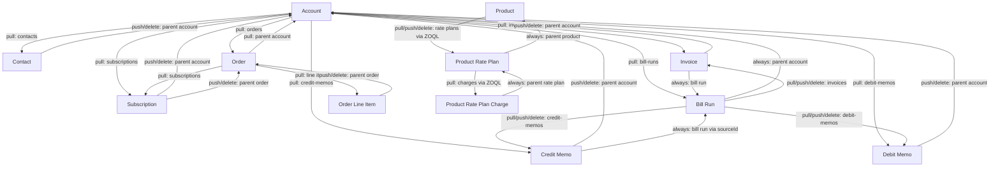

# Zuora Development Framework (zdf)

A CLI for syncing Zuora configuration and billing objects to local JSON files, editing them, and pushing changes back — with dependency-aware traversal so related records stay consistent.

ZDF is a **developer CLI for interacting with Zuora tenants**, not an environment-promotion pipeline. It covers three use cases: (1) pull/push `workflow` and `billing-template` config for editing in your IDE (incl. with AI tooling); (2) pull/push test/financial data into **lower** environments for QA and bug reproduction; (3) targeted automation such as creating products in production. Promotion between environments (IntQA → StagingUAT → Production) is handled by Zuora's native **Deployment Manager**, outside ZDF — see [`docs/promotion-deployment-manager.md`](docs/promotion-deployment-manager.md).

## Table of Contents

- [Use Cases](#use-cases)
- [Resources & Supported Actions](#resources--supported-actions)
- [Production Safety](#production-safety)
- [Setup](#setup)
- [Global Flags](#global-flags)
- [Commands](#commands)
  - [auth](#auth)
  - [pull](#pull)
  - [push](#push)
  - [create](#create)
  - [delete](#delete)
  - [list](#list)
- [Resource Reference](#resource-reference)
  - [account](#account)
  - [contact](#contact)
  - [subscription](#subscription)
  - [order / order-line-item](#order--order-line-item)
  - [product](#product)
  - [product-rate-plan](#product-rate-plan)
  - [product-rate-plan-charge](#product-rate-plan-charge)
  - [invoice](#invoice)
  - [credit-memo](#credit-memo)
  - [debit-memo](#debit-memo)
  - [bill-run](#bill-run)
  - [workflow](#workflow)
  - [billing-template](#billing-template)
  - [data-query](#data-query)
- [Dependency Graph](#dependency-graph)
- [Updatable Fields](#updatable-fields)
- [Output Directory Layout](#output-directory-layout)

---

## Use Cases

ZDF operates on **one Zuora tenant at a time** (the active `auth` environment). It is a
developer CLI, **not** an environment-promotion pipeline — promotion between environments
(IntQA → StagingUAT → Production) is handled by Zuora's native **Deployment Manager**, outside
ZDF (see [`docs/promotion-deployment-manager.md`](docs/promotion-deployment-manager.md)). Within
that scope, ZDF exists for three things:

1. **Config editing** — pull `workflow` and `billing-template` definitions to local JSON, edit
   them in your IDE (including with AI tooling like Claude Code), and push them back.
2. **Test data** — work with an account and its billing objects (contacts, subscriptions,
   orders, invoices, credit/debit memos, bill runs) for QA and bug reproduction in **lower**
   environments. The three verbs are **not** interchangeable (see the box below): `pull` exports,
   `push` updates an object **that already exists in the active tenant**, and `create` seeds a
   **new** object. Financial writes to **production** are blocked by default — see
   [Production Safety](#production-safety).
3. **Targeted automation** — scripted, one-off tasks against a single tenant, most notably
   creating products (with their rate plans and charges) in production from a ticket.

> **`push` is not a cross-tenant importer.** `push <resource> <id>` issues a
> `PUT /{resource}/{id}` against the **active** tenant — it updates an object that already exists
> *there*, by its Zuora id. Zuora ids are assigned per tenant (and re-keyed when a sandbox is
> refreshed), so a file you `pull`ed from tenant A **cannot** be `push`ed into tenant B — the id
> does not exist in B and the call 404s. To put data **into** a lower environment you `create` it
> there (which mints a new id and is subject to the per-resource body requirements in the
> [Resource Reference](#resource-reference)); `pull`/`push` are for **inspecting and round-tripping
> edits within one tenant**. ZDF does not currently auto-remap ids/parent references across
> tenants.

The `data-query` resource is a cross-cutting utility: it submits Zuora Data Query (ZOQL export)
jobs, typically to help extract the data used in use case 2.

---

## Resources & Supported Actions

The table below is the authoritative map of every Zuora resource ZDF touches, which verbs each
supports, and which use case it primarily serves. `✓` = supported; `—` = intentionally not
supported (reason in the [Resource Reference](#resource-reference)).

| Resource | Use case | pull | push | create | delete | list |
|----------|----------|:----:|:----:|:------:|:------:|:----:|
| workflow | 1 · config | ✓ | ✓ | ✓ | ✓ | — |
| billing-template | 1 · config | ✓ | ✓ | ✓ | ✓ | ✓ |
| account | 2 · test data | ✓ | ✓ | ✓ | ✓ | — |
| contact | 2 · test data | ✓ | ✓ | ✓ | ✓ | — |
| subscription | 2 · test data | ✓ | ✓ | — | — | — |
| order | 2 · test data | ✓ | ✓ | ✓ | ✓ | ✓ |
| order-line-item | 2 · test data | ✓ | ✓ | — | — | — |
| invoice | 2 · test data | ✓ | ✓ | ✓ | ✓ | — |
| credit-memo | 2 · test data | ✓ | ✓ | ✓ | ✓ | — |
| debit-memo | 2 · test data | ✓ | ✓ | ✓ | ✓ | — |
| bill-run | 2 · test data | ✓ | re-fetch¹ | ✓ ⚠² | — | — |
| product | 3 · automation | ✓ | ✓ | ✓ | ✓ | — |
| product-rate-plan | 3 · automation | ✓ | ✓ | ✓ | ✓ | — |
| product-rate-plan-charge | 3 · automation | ✓ | ✓ | ✓ | ✓ | — |
| data-query | utility | ✓³ | — | ✓⁴ | ✓⁵ | — |

¹ Bill runs have no PUT endpoint; `push bill-run` re-fetches the record (identical to `pull`).
² `create bill-run` executes **real billing** in the target tenant (generates invoices/memos).
³ `pull data-query` fetches a submitted job's **status**, not editable config.
⁴ `create data-query` submits a job from a local `.sql` file.
⁵ `delete data-query` cancels/deletes a job.

**Not universal:** only `billing-template` and `order` support `list`. `subscription` and
`order-line-item` have no `create`/`delete` (managed via the Orders API / their parent order).
`data-query` has no `push`. **`bill-run` has no `delete`** — Zuora only deletes Pending/Canceled
bill runs, and an API-created run reaches Completed almost immediately, so a delete would always
be rejected. `workflow` `pull`/`create` operate on the full **export** definition and `push`
updates settings only — see [workflow](#workflow). Per-resource endpoints, body requirements, and
status constraints are in the [Resource Reference](#resource-reference).

---

## Production Safety

ZDF applies a **write policy** based on whether the active environment is a production tenant.
An environment is "production" if it was added with a Production env type, or (in CI) if
`ZDF_IS_PRODUCTION=true`. The policy is enforced on the resource being written; **reads
(`pull`/`list`) are always allowed and never prompt.**

| On a PRODUCTION tenant | `pull` / `list` | `create` / `push` / `delete` |
|---|---|---|
| **config** — `workflow`, `billing-template` | allowed | allowed, after confirmation |
| **catalog** — `product`, `product-rate-plan`, `product-rate-plan-charge` | allowed | allowed, after confirmation (this is the "create products in prod" use case) |
| **financial** — `account`, `contact`, `subscription`, `order`, `order-line-item`, `invoice`, `credit-memo`, `debit-memo`, `bill-run` | allowed | **blocked** unless `--allow-prod-financial` (then: after confirmation) |
| **utility** — `data-query` | allowed | allowed, after confirmation |

On **non-production** environments, all writes proceed with no prompt.

**Confirmation** (only for the "after confirmation" cases above):
- Interactive terminal → a yes/no prompt (defaults to no).
- `-y` / `--yes`, or `ZDF_ASSUME_YES=true` → proceeds without prompting (prints a notice).
- **Non-interactive shell (CI) without `--yes`** → the command **fails fast** with a clear error
  instead of hanging. Set `--yes` / `ZDF_ASSUME_YES=true` in pipelines.

**Financial writes to production** additionally require `--allow-prod-financial` (or
`ZDF_ALLOW_PROD_FINANCIAL=true`). Without it, the command is refused before any network call. A
CI job that must, e.g., seed a financial fix into production would set **both**
`ZDF_ALLOW_PROD_FINANCIAL=true` and `ZDF_ASSUME_YES=true` — intentionally two explicit opt-ins.

---

## Setup

```bash
# Install dependencies and build
npm install
npm run build   # runs: tsup bin/zdf.ts --format cjs --out-dir dist

# Authenticate (saved to ~/.zdf/config.json)
node dist/zdf.js auth login --name sandbox --url https://rest.sandbox.na.zuora.com --client-id <id> --client-secret <secret>
node dist/zdf.js auth use sandbox
```

---

## Global Flags

| Flag | Description |
|------|-------------|
| `--debug` | Print every HTTP request and response body |
| `--no-dependency` | Skip dependency traversal; operate only on the specified resource |
| `--max-rows <n>` | Override the ZOQL query row cap (default 5000) for this invocation |
| `--max-nodes <n>` | Override the dependency-traversal node ceiling (default 500) for this invocation |
| `--max-items <n>` | Override the sub-item / list pagination cap (default 5000) for this invocation |
| `--no-caps` (alias `--unbounded`) | Disable all three caps above for this run; warns that the run may take a long time and could enumerate entire tables |
| `-y`, `--yes` | Assume "yes" for the production write confirmation (for non-interactive / CI use). Env: `ZDF_ASSUME_YES=true` |
| `--allow-prod-financial` | Permit `create`/`push`/`delete` of **financial** resources against a PRODUCTION environment (blocked by default). Env: `ZDF_ALLOW_PROD_FINANCIAL=true` |

The `--no-dependency` flag is essential for large accounts with hundreds of child records (orders, subscriptions, invoices) where a full traversal would be impractical.

See [Production Safety](#production-safety) for how `--yes` and `--allow-prod-financial` interact with the production write policy.

A progress indicator (spinner) is shown during long-running pulls when connected to an interactive terminal (TTY); it is silent when stdout is piped or redirected.

---

## Commands

### auth

| Subcommand | Description |
|------------|-------------|
| `auth login` | Save a new named environment (URL + OAuth credentials) |
| `auth use <name>` | Set the active environment |
| `auth show` | Show current active environment |
| `auth list` | List all saved environments |

The CLI transparently refreshes the OAuth token when it has expired, and also reactively refreshes-and-retries the request once if Zuora responds with an HTTP 401.

### pull

Fetch a resource from Zuora and write it (plus all dependent records, unless `--no-dependency`) to `zdf-output/`.

```
zdf pull <resource> <id>
```

### push

Read the local JSON file and update the resource in Zuora. Dependent records are re-fetched (pulled) to keep local files consistent.

```
zdf push <resource> <id>
```

`billing-template` is also updated via `push` (a Settings API `PUT`, not the standard `/v1/` write endpoints) — see [billing-template](#billing-template) for details:

```
zdf push billing-template <id>
```

### create

Read a local JSON file and create a new resource in Zuora. The file is renamed to the Zuora-assigned ID after creation.

```
zdf create <resource> <name>
zdf create <resource> <name> --file /path/to/file.json
```

### delete

Delete a resource in Zuora. Dependent local files are cleaned up.

```
zdf delete <resource> <id>
```

### list

Fetch all records of a type and write them to local storage.

```
zdf list orders
zdf list billing-templates
```

---

## Resource Reference

### account

| Operation | Endpoint | Notes |
|-----------|----------|-------|
| pull | `GET /v1/accounts/{id}` | Also pulls all contacts, orders, subscriptions, invoices, credit-memos, debit-memos, bill-runs for the account |
| push | `PUT /v1/accounts/{id}` | Reads from `basicInfo` section of local file |
| create | `POST /v1/accounts` | |
| delete | `DELETE /v1/accounts/{id}` | |

**Limitations:**
- `push account` reads the `basicInfo` block from the pulled file. If the file was not pulled first, the command will error.
- Pulling an account with many child records (hundreds of orders, subscriptions, etc.) can be slow. Use `--no-dependency` to skip child traversal.
- The updatable field allowlist filters out read-only fields; custom fields (`__c` suffix) always pass through.

---

### contact

| Operation | Endpoint | Notes |
|-----------|----------|-------|
| pull | `GET /v1/contacts/{id}` | |
| push | `PUT /v1/contacts/{id}` | |
| create | `POST /v1/contacts` | |
| delete | `DELETE /v1/contacts/{id}` | |

**Limitations:**
- `push contact` and `delete contact` re-pull the parent account to keep local files consistent.
- Fields like `id`, `accountId`, and `accountNumber` are stripped before push (read-only).
- `create contact`: unlike every other write endpoint in this framework, `POST /v1/contacts` returns the created contact object **directly**, with no `{success}` envelope. The create command accounts for this — it uses `assertReadSuccess` and reads the lowercase `res.id` rather than the standard `{success, id}` shape. Live-verified.

---

### subscription

Subscriptions support **pull and push only**. There is no `create subscription` or
`delete subscription` command.

| Operation | Endpoint | Notes |
|-----------|----------|-------|
| pull | `GET /v1/subscriptions/{id}` | |
| push | `PUT /v1/subscriptions/{id}` | |
| create | — | Not supported. Use the Orders API (`create order`) to establish subscriptions — Orders-enabled tenants disable the legacy Subscriptions-create API. |
| delete | — | Not supported. Zuora exposes no DELETE endpoint for subscriptions; cancel via the Orders API or the Zuora UI. |

**Limitations:**
- Only a narrow set of header-level fields is updatable (term, auto-renew, notes, etc.). Rate plan and charge modifications require the Orders API.
- `push subscription` re-pulls the parent account and linked order.

---

### order / order-line-item

| Operation | Resource | Endpoint | Notes |
|-----------|----------|----------|-------|
| pull | order | `GET /v1/orders/{orderNumber}` | Order number is the identifier (e.g. `O-00000001`) |
| pull | order-line-item | `GET /v1/order-line-items/{id}` | UUID identifier |
| list | orders | `GET /v1/orders?page=N&pageSize=50` or `GET /v1/orders/subscriptionOwner/{accountKey}?...` | Paginated; also fetches all order line item details |
| create | order | `POST /v1/orders` | |
| push | order | `PUT /v1/orders/{orderNumber}` | |
| push | order-line-item | `PUT /v1/order-line-items/{id}` | |
| delete | order | `DELETE /v1/orders/{orderNumber}` | |

**Limitations:**
- `push order` only works on orders in **Draft** or **Scheduled** status. Completed or cancelled orders cannot be updated.
- The file from `pull order` stores data under an `order` key; the push command unwraps this automatically before sending to Zuora.
- `push order` re-pulls the parent account after updating.
- There is no `create order-line-item` or `delete order-line-item` — line items are managed through the order.
- `zdf list orders` supports `--account <key>`, `--status <status>`, `--limit <n>`, and `--all`. It refuses to run with no flags at all, to avoid an accidental full-tenant export — pass `--all` to confirm one.
- `--account <key>` scopes the list via `GET /v1/orders/subscriptionOwner/{accountKey}` rather than the generic `?accountId=` filter — the generic filter is ignored server-side by the tenant and returns the unfiltered list. When `--account` and `--status` are combined, the status filter is applied client-side (the `subscriptionOwner` endpoint has no `status` query param).
- The account → orders dependency traversal (pulling an account's orders) uses the same `GET /v1/orders/subscriptionOwner/{accountKey}` endpoint.

---

### product

| Operation | Endpoint | Notes |
|-----------|----------|-------|
| pull | `GET /v1/object/product/{id}` | Legacy object endpoint; returns PascalCase field names |
| push | `PUT /v1/object/product/{id}` | Legacy object endpoint; response uses `Success`/`Errors` (PascalCase) |
| create | `POST /commerce/products` | Commerce API — creates product + plan + charge in one call. Body is snake_case. Live-verified on intQA. |
| delete | `DELETE /v1/object/product/{id}` | Legacy object endpoint (returns `{success, id}`); also removes Commerce-created products |

**Limitations:**
- **`create product` uses the Commerce API** (`POST /commerce/products`), not the legacy
  `/v1/catalog/products` (which is disabled/405 on this tenant). The request body is **snake_case**
  and posted verbatim from your local JSON file — it is a distinct schema from pull/push (which use
  the PascalCase object model). The response is the created product object (with lowercase `id`),
  not a `{success}` envelope.
- The Commerce create request must include (tenant requirements, live-verified): `pricing` as an
  object keyed by currency (e.g. `{"flatAmounts": {"USD": 10}}`); a full `accounting` block with all
  8 finance accounts non-blank; and required custom fields (product: `item__c`, `productfamily__c`;
  charge: `pobidentifier__c`, `pobname__c`). Valid accounting-code names and custom-field values are
  tenant-specific — query `/v1/accounting-codes` and inspect an existing product for valid values.
  See `CLAUDE.md` ("Product create — Commerce API") for the full reference body.
- The Zuora v1 REST API does not support `PUT` for products; the legacy `/v1/object/` endpoint must be used for pull/push/delete.
- Fields returned by pull/push (object endpoint) are PascalCase (`Name`, `SKU`, `EffectiveStartDate`). The push allowlist is configured accordingly.
- Tenant-specific required custom fields (e.g. `Item__c`) must be present in the push body too. If your tenant requires them, ensure they are in the local file before pushing.
- `pull product` traverses to all child product-rate-plans and their charges via ZOQL.

---

### product-rate-plan

| Operation | Endpoint | Notes |
|-----------|----------|-------|
| pull | `GET /v1/object/product-rate-plan/{id}` | Legacy object endpoint; PascalCase fields |
| push | `PUT /v1/object/product-rate-plan/{id}` | Legacy object endpoint; `Success`/`Errors` response |
| create | `POST /v1/object/product-rate-plan` | Legacy object endpoint; PascalCase `{Id, Success, Errors?}` response |
| delete | `DELETE /v1/object/product-rate-plan/{id}` | Legacy object endpoint |

**Limitations:**
- The Zuora v1 REST API does not support `PUT` for product rate plans; the legacy `/v1/object/` endpoint must be used for updates.
- `pull product-rate-plan` always re-pulls the parent product and all child charges.
- `push product-rate-plan` re-pulls the parent product after the update.
- Updatable fields are PascalCase: `Name`, `Description`, `EffectiveStartDate`, `EffectiveEndDate`.
- **Endpoint correction (live discovery, 2026-08-07):** create/delete were originally implemented against `POST /v1/rateplan` / `DELETE /v1/rateplan/{id}`, but that path **does not exist on the intQA tenant**. Both are now routed through the legacy `/v1/object/product-rate-plan` endpoint instead, matching pull/push. Live-verified.

---

### product-rate-plan-charge

| Operation | Endpoint | Notes |
|-----------|----------|-------|
| pull | `GET /v1/object/product-rate-plan-charge/{id}` | Legacy object endpoint; PascalCase fields |
| push | `PUT /v1/object/product-rate-plan-charge/{id}` | Legacy object endpoint; `Success`/`Errors` response |
| create | `POST /v1/object/product-rate-plan-charge` | Legacy object endpoint; PascalCase `{Id, Success, Errors?}` response |
| delete | `DELETE /v1/object/product-rate-plan-charge/{id}` | Legacy object endpoint; returns lowercase `{success, id, errors?}` |

**Limitations:**
- The Zuora v1 REST API does not support `PUT` for product rate plan charges; the legacy `/v1/object/` endpoint must be used for updates.
- `ChargeType` and `ChargeModel` are read-only and cannot be updated.
- `create product-rate-plan-charge` requires `ProductRatePlanId` (the parent rate plan), a tenant-required custom field picklist `POBIdentifier__c`, and `ProductRatePlanChargeTierData` (pricing tiers). **Live-verified on intQA**: created, pulled, pushed, and torn down successfully.
- Delete is effectively cascade: deleting the parent product-rate-plan removes its charges, so `delete product-rate-plan-charge` is rarely called directly.
- `pull product-rate-plan-charge` always re-pulls the parent product-rate-plan.

---

### invoice

| Operation | Endpoint | Notes |
|-----------|----------|-------|
| pull | `GET /v1/invoices/{id}` + `GET /v1/invoices/{id}/items` | Line items are embedded inline in the local file |
| push | `PUT /v1/invoices/{id}` | |
| create | `POST /v1/invoices` (`--post` adds `status:Posted`) | Standalone invoice, created **Draft** by default. Flat single-invoice body; accounting fields required per item (see below). Live-verified. |
| delete | status check → `PUT /v1/invoices/{id}/cancel` → `DELETE /v1/invoices/{id}` | Draft only: cancels then deletes, polling the invoice for disappearance. **Posted invoices are rejected up front** (not deletable on this tenant). |

**Limitations:**
- Invoice line items (`invoiceItems`) are embedded in the pulled file for reference but **stripped from the push body** — Zuora does not accept them in a PUT request.
- Only header-level fields are updatable: `autoPay`, `comments`, `dueDate`, `invoiceDate`, `paymentTerm`, `transferredToAccounting`.
- **`create invoice`** posts a **flat single-invoice object** (`{ accountNumber, invoiceDate, invoiceItems: [...] }`) verbatim from your local file. Because this tenant does not default the Non-Subscription-Items accounting settings, **each invoice item must include** the amount as `amount` (not `chargeAmount`/`unitPrice`), date fields in `yyyy-MM-dd HH:mm:ss` format, a `revenueRecognitionRuleName` (e.g. `Recognize upon invoicing`), and the 8 accounting codes (`deferredRevenueAccountingCode`, `recognizedRevenueAccountingCode`, `unbilledReceivablesAccountingCode`, `contractAssetAccountingCode`, `contractLiabilityAccountingCode`, `contractRecognizedRevenueAccountingCode`, `adjustmentLiabilityAccountingCode`, `adjustmentRevenueAccountingCode`). Valid values are tenant-specific — see `CLAUDE.md` → "Invoice create / delete". Most invoices are still generated by bill runs, not `create invoice` directly.
- **`create invoice --post`** creates the invoice already in **Posted** status (injects `status: "Posted"`). A Posted invoice **cannot be cancelled or deleted** on this tenant, so the command prints a warning. Omit `--post` (the default) to create a Draft invoice you can later delete. Note: there is no way to post an *already-existing* Draft invoice via the API on this tenant — posting only happens at create time.
- **`delete invoice`** first fetches the invoice's status. On this tenant only **Draft** invoices are deletable (cancel is allowed on Draft → Cancelled → delete); a **Posted** invoice is rejected up front with a clear message (reverse it with a credit memo instead). For a Draft invoice it cancels, then deletes, then confirms by polling `GET /v1/invoices/{id}` until the invoice no longer exists (every 2s, up to 60s) — the delete job is **not** observable via the async-jobs endpoint.
- `push invoice` and `delete invoice` re-pull the parent account (the delete re-pull warns harmlessly since the invoice is already gone).

---

### credit-memo

| Operation | Endpoint | Notes |
|-----------|----------|-------|
| pull | `GET /v1/credit-memos/{id}` + `GET /v1/credit-memos/{id}/items` | Line items embedded inline |
| push | `PUT /v1/credit-memos/{id}` | |
| create | `POST /v1/credit-memos/invoice/{invoiceKey}` | Invoice-scoped; requires `--invoice <invoiceId>`. **Live-verified.** |
| delete | GET status → (Draft) `PUT /v1/credit-memos/{id}/cancel` → `DELETE /v1/credit-memos/{id}` | Draft memos are cancelled first, then deleted; Cancelled memos delete directly; Posted rejected (see note) |

**Limitations:**
- Credit memo line items (`creditMemoItems`) are embedded for reference but stripped from the push body.
- `creditMemoDate` and `autoApplyUponPosting` are **not updatable** on Posted memos (live-verified: Zuora rejects them). These fields are excluded from the push allowlist.
- **`create credit-memo`** requires `--invoice <invoiceId>` pointing at a **Posted** source invoice (a Draft source is rejected: "Invoice is not posted"). The CLI posts the local file **verbatim** to `POST /v1/credit-memos/invoice/{invoiceKey}`; the bare `POST /v1/credit-memos` is unreliable on this tenant. The file must be `{ "items": [ { "invoiceItemId": "<id>", "amount": <n>, "skuName": "<label>" } ] }` — **each item requires `invoiceItemId`, `amount`, and a non-blank `skuName`** (Zuora rejects a blank SKU: "SKU name is blank"). Get `invoiceItemId` from `GET /v1/invoices/{id}/items` (or a pulled invoice). Omitting `--invoice` fails fast before any network call. **Live-verified end-to-end** (create → pull → Draft memo with items).
- `push credit-memo` re-pulls the parent account.
- **`delete credit-memo`** is status-aware. Zuora only deletes a **Cancelled** credit memo, and only a **Draft** memo can be cancelled. The command GETs the memo first: a **Draft** memo is cancelled (`PUT /v1/credit-memos/{id}/cancel`) then deleted; an already-**Cancelled** memo is deleted directly; a **Posted** memo is rejected up front (it can't be cancelled, so it isn't deletable this way — reverse it through the normal accounting flow). A Draft memo isn't applied to its invoice yet (application happens on posting), so no unapply step is needed. Note the status spelling is Zuora's single-L `Canceled`. **Live-verified end-to-end on intQA (2026-08-21):** account → Posted invoice → Draft credit memo → `delete` (cancel → delete) → confirmed gone.

---

### debit-memo

| Operation | Endpoint | Notes |
|-----------|----------|-------|
| pull | `GET /v1/debit-memos/{id}` + `GET /v1/debit-memos/{id}/items` | Line items embedded inline |
| push | `PUT /v1/debit-memos/{id}` | |
| create | `POST /v1/debit-memos/invoice/{invoiceKey}` | Invoice-scoped; requires `--invoice <invoiceId>`. **Live-verified.** |
| delete | GET status → (Draft) `PUT /v1/debit-memos/{id}/cancel` → `DELETE /v1/debit-memos/{id}` | Draft memos are cancelled first, then deleted; Cancelled memos delete directly; Posted rejected (see note) |

**Limitations:**
- Debit memo line items (`debitMemoItems`) are embedded for reference but stripped from the push body.
- `debitMemoDate` and `dueDate` are **not updatable** on Posted memos (live-verified: Zuora rejects them). These fields are excluded from the push allowlist.
- **`create debit-memo`** requires `--invoice <invoiceId>` pointing at a **Posted** source invoice. Same body contract as credit-memo: `{ "items": [ { "invoiceItemId": "<id>", "amount": <n>, "skuName": "<label>" } ] }` — **each item requires `invoiceItemId`, `amount`, and a non-blank `skuName`**. Posted verbatim to `POST /v1/debit-memos/invoice/{invoiceKey}`; the bare `POST /v1/debit-memos` is unreliable on this tenant. Omitting `--invoice` fails fast. **Live-verified end-to-end** (create → pull → Draft memo with items).
- `push debit-memo` re-pulls the parent account.
- **`delete debit-memo`** is status-aware, identical to credit-memo: GET first, cancel a **Draft** memo (`PUT /v1/debit-memos/{id}/cancel`) then delete, delete an already-**Canceled** memo directly, reject a **Posted** memo. **Live-verified end-to-end on intQA (2026-08-21)** alongside the credit-memo cycle.

---

### bill-run

| Operation | Endpoint | Notes |
|-----------|----------|-------|
| pull | `GET /v1/bill-runs/{id}` | Also pulls all invoices, credit-memos, debit-memos produced by the run |
| push | — | No PUT endpoint exists; `push bill-run` re-fetches (same as pull) |
| create | `POST /v1/bill-runs` | **WARNING: executes real billing** — see below |
| delete | — | **Not supported / removed** — see below |

**Limitations:**
- **`create bill-run` executes real billing in the target tenant.** It is not a dry run: it generates real invoices and/or credit memos for the accounts/subscriptions in scope. The CLI prints a prominent warning before submitting the create. **Live-verified on intQA**: create, pull, and push-as-refetch all PASS.
- **Bill runs cannot be updated** via the Zuora API. `push bill-run` re-fetches the latest data rather than writing anything.
- **There is no `delete bill-run` command.** Zuora only deletes bill runs in **Pending** or **Canceled** status, but a bill run created via the API runs to **Completed** almost immediately, so a delete would always be rejected. The command was removed rather than left as a guaranteed-failure stub.

---

### workflow

Workflows are handled through Zuora's Workflow **export/import** API so the local file is the
**full, recreatable definition** (`workflow_definition`, `workflow`, `tasks`, `linkages`) — not
just metadata.

| Operation | Endpoint | Notes |
|-----------|----------|-------|
| pull | `GET /workflows/{id}/export` | Writes the full definition (settings + tasks + linkages), the same shape `create` consumes |
| create | `POST /workflows/import` | Imports the local export file as a **new** workflow (new definition id); JSON body |
| push | `PUT /workflows/{id}` | Updates **settings only** (name, description, triggers, status); remaps the export shape to the PUT body |
| delete | `DELETE /workflows/{id}` | Returns `{success, id}` |

**Limitations:**
- The endpoint base is `/workflows` (not `/v1/api/workflows` or a `/v1/`-prefixed path).
- **`pull` fetches the full export** (`/export`), not `GET /workflows/{id}` (which returns only metadata). This makes `pull` → edit → `create` a full-fidelity round-trip and is required for `create` to have something to import.
- **`create` imports a NEW workflow** — `POST /workflows/import` never updates in place; it always mints a new definition id. Use it to copy/restore a workflow or to apply task-graph edits (Zuora has no in-place task-graph update API). An import payload must contain at least one task **and** at least one linkage. The response is the created workflow object directly (no `{success}` envelope).
- **`push` updates workflow settings only** — name, description, triggers, status, interval, timezone — via `PUT /workflows/{id}`. It does **not** apply task/linkage edits; re-apply those with `create`. The command remaps the export file's snake_case settings to the camelCase PUT body.
- **You cannot edit the logic (task graph) of an existing workflow's *active version* in place via the API** (verified live 2026-08-21): `PUT /workflows/{id}` ignores `tasks`/`linkages`, `POST /workflows/import` always mints a **new** definition (even with `?workflow_id=`), and there is no public per-version/task update endpoint. In-place logic editing is UI-builder-only. To get edited logic into Zuora, `create` (import) it as a new workflow.
- Workflow PUT/export responses have no `{success}` envelope (handled via `assertReadSuccess`); DELETE returns `{success, id}`.
- **Live-verified end-to-end on intQA (2026-08-21)**: a workflow authored from scratch (definition + one task + one linkage) → `create` → `pull` → `push` (description edit confirmed) → `delete` → confirm-gone all PASS.

---

### billing-template

HTML invoice templates only, accessed via the Zuora **Settings API** (`/settings/...`, not `/v1/`-prefixed).

| Operation | Endpoint | Notes |
|-----------|----------|-------|
| pull | `GET /settings/invoice-templates/{id}` | Base64-decodes `base64EncodedTemplateFileContent` to JSON and writes it as `<name>_<id>.json`; rejects non-HTML (WORD) templates |
| push | `PUT /settings/invoice-templates/{id}` | Re-encodes the local JSON to base64 and sends an allowlisted body |
| create | `POST /settings/invoice-templates` | Base64-encodes the local design JSON, HTML-only; renames the local file to `<name>_<id>.json` |
| delete | `DELETE /settings/invoice-templates/{id}` | Removes the remote template and its local file |
| list | `GET /settings/invoice-templates` (`zdf list billing-templates`) | Metadata only (id, name, templateNumber, templateFormat) |

**Limitations:**
- **HTML templates only.** WORD-format templates are not supported — their content is a binary `.doc`, not JSON, so `pull billing-template` rejects them. `create billing-template` always sends `templateFormat: 'HTML'`.
- `push billing-template` sends an allowlisted body (`name`, `defaultTemplate`, `suppressZeroValueLine`, `templateFileName`, `base64EncodedTemplateFileContent`), plus any `__c` custom fields. It is deliberately an allowlist rather than "current minus a denylist" — the Settings API rejects unexpected keys.
- The Settings API response for both pull and push has no `success` envelope at all on success — only an explicit `success: false` or a populated `reasons`/`errors` array is treated as a failure.
- **Live-verified full cycle on intQA (2026-08-07)**: create / confirm / push / delete / confirm-deletion all PASS.

---

### data-query

A utility for submitting Zuora **Data Query** (ZOQL export) jobs — used to extract tenant data,
typically in support of the test-data use case. It manages *jobs*, not editable configuration,
so there is no `push`.

| Operation | Endpoint | Notes |
|-----------|----------|-------|
| pull | `GET /query/jobs/{id}` | Fetches a submitted job's **status** by job ID |
| create | `POST /query/jobs` | Submits a job from a local `.sql` file and polls it to completion |
| delete | `DELETE /query/jobs/{id}` | Cancels / deletes a job |
| push | — | Not supported — a data query is a job, not a mutable resource |
| list | — | Not supported |

**Limitations:**
- `create data-query` reads a `.sql` file (the ZOQL export query), submits it, and polls until
  the job finishes. It does not itself download the result set — retrieve exported files via the
  URL Zuora returns in the completed job.
- `data-query` is **standalone**: it participates in no dependency traversal.

---

## Dependency Graph

When you pull or push a resource, the CLI automatically traverses its dependency tree (unless `--no-dependency` is set). The diagram below shows which resources are traversed for each operation.

**Standalone resources (no traversal):** `workflow`, `billing-template`, and `data-query` have
**no** dependency edges — they are always fetched/written on their own, regardless of
`--no-dependency`. This is why the config-editing use case (workflow / billing-template) never
pulls unrelated objects. Only the account-rooted financial graph and the product-catalog graph
below are traversed.



### Traversal Rules Summary

| Resource | Dependency Direction | Condition |
|----------|---------------------|-----------|
| account | → contacts, orders, subscriptions, invoices, credit-memos, debit-memos, bill-runs | pull only |
| account | → parent account (if `parentId` set) | always |
| contact | → parent account | push/delete only |
| order | → parent account (via account number lookup) | always |
| order | → order line items, subscriptions | always |
| order-line-item | → parent order | push/delete only |
| subscription | → parent account, parent order | push/delete only |
| product | → product-rate-plans (ZOQL) | always |
| product-rate-plan | → parent product | always |
| product-rate-plan | → product-rate-plan-charges (ZOQL) | pull only |
| product-rate-plan-charge | → parent product-rate-plan | always |
| invoice | → parent account | push/delete only |
| invoice | → bill run (if `billRunId` set) | always |
| credit-memo | → parent account | push/delete only |
| credit-memo | → bill run (if `sourceId` set, via ZOQL) | always |
| debit-memo | → parent account | push/delete only |
| bill-run | → parent account (if `accountId` set) | always |
| bill-run | → invoices (ZOQL), credit-memos, debit-memos (ZOQL) | always |

A visited-set prevents loops: if a resource has already been processed in the current traversal it is skipped, so circular relationships (e.g. account → order → account) do not cause infinite recursion.

**Partial-traversal reporting.** If a related object can't be pulled — because a lookup fails (e.g. Zuora rejects a ZOQL query) or an individual dependent fetch errors — the requested object itself is still pulled successfully, and at the end of the run ZDF prints **one consolidated warning per parent** listing what was missed, e.g.:

```
⚠ Some dependent objects of bill-run BR-001 were not pulled: invoices (invalid type: invoice); debit-memos (…)
```

This never aborts the pull and never writes a corrupt file — it only tells you which related records were skipped so you can re-pull them explicitly if needed.

---

## Updatable Fields

`push` commands strip all fields not in the allowlist before sending to Zuora. Custom fields (ending in `__c`) always pass through regardless of the allowlist.

| Resource | Sample Updatable Fields |
|----------|------------------------|
| account | `name`, `autoPay`, `paymentTerm`, `notes`, `batch`, `billCycleDay` |
| contact | `firstName`, `lastName`, `workEmail`, `address1`, `city`, `state`, `country` |
| subscription | `autoRenew`, `notes`, `currentTerm`, `renewalTerm`, `termType` |
| order | `category`, `description`, `orderDate`, `reasonCode` |
| order-line-item | `itemName`, `quantity`, `amountPerUnit`, `description`, `taxCode` |
| product | `Name`, `SKU`, `Description`, `EffectiveStartDate`, `EffectiveEndDate`, `AllowFeatureChanges` |
| product-rate-plan | `Name`, `Description`, `EffectiveStartDate`, `EffectiveEndDate` |
| product-rate-plan-charge | `Name`, `Description`, `BillingPeriod`, `AccountingCode`, `TaxCode`, `UOM` |
| invoice | `autoPay`, `comments`, `dueDate`, `invoiceDate`, `paymentTerm` |
| credit-memo | `comment`, `excludeFromAutoApplyRules`, `reasonCode`, `transferredToAccounting` |
| debit-memo | `autoPay`, `comment`, `paymentTerm`, `reasonCode`, `transferredToAccounting` |

Note: product, product-rate-plan, and product-rate-plan-charge use the legacy `/v1/object/` API which requires **PascalCase** field names.

---

## Output Directory Layout

```
zdf-output/
├── accounts/
│   └── {id}.json
├── contacts/
│   └── {id}.json
├── subscriptions/
│   └── {id}.json
├── orders/
│   └── {orderNumber}.json
├── order-line-items/
│   └── {id}.json
├── products/
│   └── {id}.json
├── product-rate-plans/
│   └── {id}.json
├── product-rate-plan-charges/
│   └── {id}.json
├── invoices/
│   └── {id}.json
├── credit-memos/
│   └── {id}.json
├── debit-memos/
│   └── {id}.json
├── bill-runs/
│   └── {id}.json
├── workflows/
│   └── {id}.json
├── billing-templates/
│   └── {name}_{id}.json
└── data-queries/
    └── {jobId}.json
```

Files are written atomically (full replacement on every pull/push). The filename is normally the Zuora ID or order number — files are renamed automatically after `create` once Zuora returns the assigned ID. `billing-template` files are named `{name}_{id}.json` (the id is the segment after the last `_`); `data-query` files are keyed by job ID.
