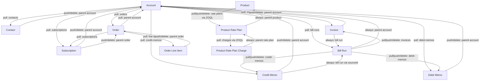

# Zuora Development Framework (zdf)

A CLI for syncing Zuora configuration and billing objects to local JSON files, editing them, and pushing changes back — with dependency-aware traversal so related records stay consistent.

## Table of Contents

- [Setup](#setup)
- [Global Flags](#global-flags)
- [Commands](#commands)
  - [auth](#auth)
  - [pull](#pull)
  - [push](#push)
  - [create](#create)
  - [delete](#delete)
  - [list](#list)
  - [sync-diff (CI/CD)](#sync-diff-cicd)
- [Resource Reference](#resource-reference)
  - [account](#account)
  - [contact](#contact)
  - [subscription](#subscription)
  - [order / order-line-item](#order--order-line-item)
  - [product](#product)
  - [product-rate-plan](#product-rate-plan)
  - [product-rate-plan-charge](#product-rate-plan-charge)
  - [invoice](#invoice)
  - [credit-memo](#credit-memo)
  - [debit-memo](#debit-memo)
  - [bill-run](#bill-run)
  - [workflow](#workflow)
  - [billing-template](#billing-template)
- [Dependency Graph](#dependency-graph)
- [Updatable Fields](#updatable-fields)
- [Output Directory Layout](#output-directory-layout)

---

## Setup

```bash
# Install dependencies and build
npm install
npm run build   # runs: tsup bin/zdf.ts --format cjs --out-dir dist

# Authenticate (saved to ~/.zdf/config.json)
node dist/zdf.js auth login --name sandbox --url https://rest.sandbox.na.zuora.com --client-id <id> --client-secret <secret>
node dist/zdf.js auth use sandbox
```

---

## Global Flags

| Flag | Description |
|------|-------------|
| `--debug` | Print every HTTP request and response body |
| `--no-dependency` | Skip dependency traversal; operate only on the specified resource |
| `--max-rows <n>` | Override the ZOQL query row cap (default 5000) for this invocation |
| `--max-nodes <n>` | Override the dependency-traversal node ceiling (default 500) for this invocation |
| `--max-items <n>` | Override the sub-item / list pagination cap (default 5000) for this invocation |
| `--no-caps` (alias `--unbounded`) | Disable all three caps above for this run; warns that the run may take a long time and could enumerate entire tables |

The `--no-dependency` flag is essential for large accounts with hundreds of child records (orders, subscriptions, invoices) where a full traversal would be impractical.

A progress indicator (spinner) is shown during long-running pulls when connected to an interactive terminal (TTY); it is silent when stdout is piped or redirected.

---

## Commands

### auth

| Subcommand | Description |
|------------|-------------|
| `auth login` | Save a new named environment (URL + OAuth credentials) |
| `auth use <name>` | Set the active environment |
| `auth show` | Show current active environment |
| `auth list` | List all saved environments |

The CLI transparently refreshes the OAuth token when it has expired, and also reactively refreshes-and-retries the request once if Zuora responds with an HTTP 401.

### pull

Fetch a resource from Zuora and write it (plus all dependent records, unless `--no-dependency`) to `zdf-output/`.

```
zdf pull <resource> <id>
```

### push

Read the local JSON file and update the resource in Zuora. Dependent records are re-fetched (pulled) to keep local files consistent.

```
zdf push <resource> <id>
```

`billing-template` is also updated via `push` (a Settings API `PUT`, not the standard `/v1/` write endpoints) — see [billing-template](#billing-template) for details:

```
zdf push billing-template <id>
```

### create

Read a local JSON file and create a new resource in Zuora. The file is renamed to the Zuora-assigned ID after creation.

```
zdf create <resource> <name>
zdf create <resource> <name> --file /path/to/file.json
```

### delete

Delete a resource in Zuora. Dependent local files are cleaned up.

```
zdf delete <resource> <id>
```

### list

Fetch all records of a type and write them to local storage.

```
zdf list orders
zdf list billing-templates
```

### sync-diff (CI/CD)

> **⚠️ PLANNED — not yet implemented.** This documents the intended contract; the feature is
> specced in `TODO.md` → "🆕 PROPOSED FEATURE … `zdf sync-diff`". Remove this banner once built.

Reconcile a set of changed `zdf-output/` files with Zuora by firing the appropriate
create/push/delete per file. This is the engine behind the GitHub↔Zuora CI/CD pipeline: a
GitHub Actions workflow computes `git diff --name-status` for the committed `zdf-output/` tree
and pipes it in.

```
# Preview the plan (default; no network calls) — used for the PR-comment dry run
git diff --name-status <base> <head> -- Zuora/zdf-output | zdf sync-diff --dry-run --format markdown

# Execute the plan against the active environment — used on merge
git diff --name-status <base> <head> -- Zuora/zdf-output | zdf sync-diff --apply
```

| Flag | Description |
|------|-------------|
| `--dry-run` | (default) Resolve and print the plan; make no network calls |
| `--apply` | Execute each planned, eligible action |
| `--diff-file <path>` | Read the `git diff --name-status` output from a file instead of stdin |
| `--format text\|markdown\|json` | Output format (default `text`; `markdown` renders the PR-comment table) |
| `--root <dir>` | zdf-output root to resolve files against (default: `ZDF_OUTPUT_DIR` or `zdf-output`) |

**Behavior:**
- Maps each changed file to a resource + id + operation: **A**dded → `create`, **M**odified →
  `push`, **D**eleted → `delete` (renames → delete old + create new).
- All actions run with `--no-dependency` (object only; no child re-pull, no local file churn).
- **Guardrails:** never fires `create bill-run` (executes real billing); operations with no
  supported command — `create`/`delete subscription` (removed), `push bill-run` (re-fetch only),
  and any `data-query` op — are **skipped with a warning**, not failed. (No resource is currently
  tenant-blocked, but any future block in `delete-guard.ts` is skipped the same way.)
- Exit `0` on a clean run (including skips); exit `1` if any *eligible* action fails.

See `TODO.md` for the full spec and the GitHub Actions workflow it powers.

---

## Resource Reference

### account

| Operation | Endpoint | Notes |
|-----------|----------|-------|
| pull | `GET /v1/accounts/{id}` | Also pulls all contacts, orders, subscriptions, invoices, credit-memos, debit-memos, bill-runs for the account |
| push | `PUT /v1/accounts/{id}` | Reads from `basicInfo` section of local file |
| create | `POST /v1/accounts` | |
| delete | `DELETE /v1/accounts/{id}` | |

**Limitations:**
- `push account` reads the `basicInfo` block from the pulled file. If the file was not pulled first, the command will error.
- Pulling an account with many child records (hundreds of orders, subscriptions, etc.) can be slow. Use `--no-dependency` to skip child traversal.
- The updatable field allowlist filters out read-only fields; custom fields (`__c` suffix) always pass through.

---

### contact

| Operation | Endpoint | Notes |
|-----------|----------|-------|
| pull | `GET /v1/contacts/{id}` | |
| push | `PUT /v1/contacts/{id}` | |
| create | `POST /v1/contacts` | |
| delete | `DELETE /v1/contacts/{id}` | |

**Limitations:**
- `push contact` and `delete contact` re-pull the parent account to keep local files consistent.
- Fields like `id`, `accountId`, and `accountNumber` are stripped before push (read-only).
- `create contact`: unlike every other write endpoint in this framework, `POST /v1/contacts` returns the created contact object **directly**, with no `{success}` envelope. The create command accounts for this — it uses `assertReadSuccess` and reads the lowercase `res.id` rather than the standard `{success, id}` shape. Live-verified.

---

### subscription

Subscriptions support **pull and push only**. There is no `create subscription` or
`delete subscription` command.

| Operation | Endpoint | Notes |
|-----------|----------|-------|
| pull | `GET /v1/subscriptions/{id}` | |
| push | `PUT /v1/subscriptions/{id}` | |
| create | — | Not supported. Use the Orders API (`create order`) to establish subscriptions — Orders-enabled tenants disable the legacy Subscriptions-create API. |
| delete | — | Not supported. Zuora exposes no DELETE endpoint for subscriptions; cancel via the Orders API or the Zuora UI. |

**Limitations:**
- Only a narrow set of header-level fields is updatable (term, auto-renew, notes, etc.). Rate plan and charge modifications require the Orders API.
- `push subscription` re-pulls the parent account and linked order.

---

### order / order-line-item

| Operation | Resource | Endpoint | Notes |
|-----------|----------|----------|-------|
| pull | order | `GET /v1/orders/{orderNumber}` | Order number is the identifier (e.g. `O-00000001`) |
| pull | order-line-item | `GET /v1/order-line-items/{id}` | UUID identifier |
| list | orders | `GET /v1/orders?page=N&pageSize=50` or `GET /v1/orders/subscriptionOwner/{accountKey}?...` | Paginated; also fetches all order line item details |
| create | order | `POST /v1/orders` | |
| push | order | `PUT /v1/orders/{orderNumber}` | |
| push | order-line-item | `PUT /v1/order-line-items/{id}` | |
| delete | order | `DELETE /v1/orders/{orderNumber}` | |

**Limitations:**
- `push order` only works on orders in **Draft** or **Scheduled** status. Completed or cancelled orders cannot be updated.
- The file from `pull order` stores data under an `order` key; the push command unwraps this automatically before sending to Zuora.
- `push order` re-pulls the parent account after updating.
- There is no `create order-line-item` or `delete order-line-item` — line items are managed through the order.
- `zdf list orders` supports `--account <key>`, `--status <status>`, `--limit <n>`, and `--all`. It refuses to run with no flags at all, to avoid an accidental full-tenant export — pass `--all` to confirm one.
- `--account <key>` scopes the list via `GET /v1/orders/subscriptionOwner/{accountKey}` rather than the generic `?accountId=` filter — the generic filter is ignored server-side by the tenant and returns the unfiltered list. When `--account` and `--status` are combined, the status filter is applied client-side (the `subscriptionOwner` endpoint has no `status` query param).
- The account → orders dependency traversal (pulling an account's orders) uses the same `GET /v1/orders/subscriptionOwner/{accountKey}` endpoint.

---

### product

| Operation | Endpoint | Notes |
|-----------|----------|-------|
| pull | `GET /v1/object/product/{id}` | Legacy object endpoint; returns PascalCase field names |
| push | `PUT /v1/object/product/{id}` | Legacy object endpoint; response uses `Success`/`Errors` (PascalCase) |
| create | `POST /commerce/products` | Commerce API — creates product + plan + charge in one call. Body is snake_case. Live-verified on intQA. |
| delete | `DELETE /v1/object/product/{id}` | Legacy object endpoint (returns `{success, id}`); also removes Commerce-created products |

**Limitations:**
- **`create product` uses the Commerce API** (`POST /commerce/products`), not the legacy
  `/v1/catalog/products` (which is disabled/405 on this tenant). The request body is **snake_case**
  and posted verbatim from your local JSON file — it is a distinct schema from pull/push (which use
  the PascalCase object model). The response is the created product object (with lowercase `id`),
  not a `{success}` envelope.
- The Commerce create request must include (tenant requirements, live-verified): `pricing` as an
  object keyed by currency (e.g. `{"flatAmounts": {"USD": 10}}`); a full `accounting` block with all
  8 finance accounts non-blank; and required custom fields (product: `item__c`, `productfamily__c`;
  charge: `pobidentifier__c`, `pobname__c`). Valid accounting-code names and custom-field values are
  tenant-specific — query `/v1/accounting-codes` and inspect an existing product for valid values.
  See `CLAUDE.md` ("Product create — Commerce API") for the full reference body.
- The Zuora v1 REST API does not support `PUT` for products; the legacy `/v1/object/` endpoint must be used for pull/push/delete.
- Fields returned by pull/push (object endpoint) are PascalCase (`Name`, `SKU`, `EffectiveStartDate`). The push allowlist is configured accordingly.
- Tenant-specific required custom fields (e.g. `Item__c`) must be present in the push body too. If your tenant requires them, ensure they are in the local file before pushing.
- `pull product` traverses to all child product-rate-plans and their charges via ZOQL.

---

### product-rate-plan

| Operation | Endpoint | Notes |
|-----------|----------|-------|
| pull | `GET /v1/object/product-rate-plan/{id}` | Legacy object endpoint; PascalCase fields |
| push | `PUT /v1/object/product-rate-plan/{id}` | Legacy object endpoint; `Success`/`Errors` response |
| create | `POST /v1/object/product-rate-plan` | Legacy object endpoint; PascalCase `{Id, Success, Errors?}` response |
| delete | `DELETE /v1/object/product-rate-plan/{id}` | Legacy object endpoint |

**Limitations:**
- The Zuora v1 REST API does not support `PUT` for product rate plans; the legacy `/v1/object/` endpoint must be used for updates.
- `pull product-rate-plan` always re-pulls the parent product and all child charges.
- `push product-rate-plan` re-pulls the parent product after the update.
- Updatable fields are PascalCase: `Name`, `Description`, `EffectiveStartDate`, `EffectiveEndDate`.
- **Endpoint correction (live discovery, 2026-08-07):** create/delete were originally implemented against `POST /v1/rateplan` / `DELETE /v1/rateplan/{id}`, but that path **does not exist on the intQA tenant**. Both are now routed through the legacy `/v1/object/product-rate-plan` endpoint instead, matching pull/push. Live-verified.

---

### product-rate-plan-charge

| Operation | Endpoint | Notes |
|-----------|----------|-------|
| pull | `GET /v1/object/product-rate-plan-charge/{id}` | Legacy object endpoint; PascalCase fields |
| push | `PUT /v1/object/product-rate-plan-charge/{id}` | Legacy object endpoint; `Success`/`Errors` response |
| create | `POST /v1/object/product-rate-plan-charge` | Legacy object endpoint; PascalCase `{Id, Success, Errors?}` response |
| delete | `DELETE /v1/object/product-rate-plan-charge/{id}` | Legacy object endpoint; returns lowercase `{success, id, errors?}` |

**Limitations:**
- The Zuora v1 REST API does not support `PUT` for product rate plan charges; the legacy `/v1/object/` endpoint must be used for updates.
- `ChargeType` and `ChargeModel` are read-only and cannot be updated.
- `create product-rate-plan-charge` requires `ProductRatePlanId` (the parent rate plan), a tenant-required custom field picklist `POBIdentifier__c`, and `ProductRatePlanChargeTierData` (pricing tiers). **Live-verified on intQA**: created, pulled, pushed, and torn down successfully.
- Delete is effectively cascade: deleting the parent product-rate-plan removes its charges, so `delete product-rate-plan-charge` is rarely called directly.
- `pull product-rate-plan-charge` always re-pulls the parent product-rate-plan.

---

### invoice

| Operation | Endpoint | Notes |
|-----------|----------|-------|
| pull | `GET /v1/invoices/{id}` + `GET /v1/invoices/{id}/items` | Line items are embedded inline in the local file |
| push | `PUT /v1/invoices/{id}` | |
| create | `POST /v1/invoices` | Standalone invoice. Flat single-invoice body; accounting fields required per item (see below). Live-verified. |
| delete | `PUT /v1/invoices/{id}/cancel` then `DELETE /v1/invoices/{id}` | Cancels first (a Draft invoice can't be deleted directly), then deletes and polls the invoice for disappearance. |

**Limitations:**
- Invoice line items (`invoiceItems`) are embedded in the pulled file for reference but **stripped from the push body** — Zuora does not accept them in a PUT request.
- Only header-level fields are updatable: `autoPay`, `comments`, `dueDate`, `invoiceDate`, `paymentTerm`, `transferredToAccounting`.
- **`create invoice`** posts a **flat single-invoice object** (`{ accountNumber, invoiceDate, invoiceItems: [...] }`) verbatim from your local file. Because this tenant does not default the Non-Subscription-Items accounting settings, **each invoice item must include** the amount as `amount` (not `chargeAmount`/`unitPrice`), date fields in `yyyy-MM-dd HH:mm:ss` format, a `revenueRecognitionRuleName` (e.g. `Recognize upon invoicing`), and the 8 accounting codes (`deferredRevenueAccountingCode`, `recognizedRevenueAccountingCode`, `unbilledReceivablesAccountingCode`, `contractAssetAccountingCode`, `contractLiabilityAccountingCode`, `contractRecognizedRevenueAccountingCode`, `adjustmentLiabilityAccountingCode`, `adjustmentRevenueAccountingCode`). Valid values are tenant-specific — see `CLAUDE.md` → "Invoice create / delete". Most invoices are still generated by bill runs, not `create invoice` directly.
- **`delete invoice`** is a two-step operation: it first cancels the invoice (Zuora rejects deleting anything but Cancelled/Split invoices — a freshly created invoice is Draft), then deletes it. If the cancel fails (e.g. the invoice is already cancelled), it warns and still attempts the delete. Completion is confirmed by polling `GET /v1/invoices/{id}` until the invoice no longer exists (every 2s, up to 60s) — the delete job is **not** observable via the async-jobs endpoint.
- `push invoice` and `delete invoice` re-pull the parent account (the delete re-pull warns harmlessly since the invoice is already gone).

---

### credit-memo

| Operation | Endpoint | Notes |
|-----------|----------|-------|
| pull | `GET /v1/credit-memos/{id}` + `GET /v1/credit-memos/{id}/items` | Line items embedded inline |
| push | `PUT /v1/credit-memos/{id}` | |
| create | `POST /v1/credit-memos/invoice/{invoiceKey}` | Invoice-scoped; requires `--invoice <invoiceId>` |
| delete | `DELETE /v1/credit-memos/{id}` | Must be in Draft status |

**Limitations:**
- Credit memo line items (`creditMemoItems`) are embedded for reference but stripped from the push body.
- Deletion requires the memo to be in **Draft** status.
- `creditMemoDate` and `autoApplyUponPosting` are **not updatable** on Posted memos (live-verified: Zuora rejects them). These fields are excluded from the push allowlist.
- `create credit-memo` requires `--invoice <invoiceId>` (the source invoice) — the bare `POST /v1/credit-memos` endpoint is unreliable on this tenant (live-verified); the CLI posts to the invoice-scoped `POST /v1/credit-memos/invoice/{invoiceKey}` endpoint instead. Omitting `--invoice` fails fast with a clear error before any network call. The caller is responsible for including `skuName` in each line item (live-verified requirement on this tenant).
- `push credit-memo` and `delete credit-memo` re-pull the parent account.

---

### debit-memo

| Operation | Endpoint | Notes |
|-----------|----------|-------|
| pull | `GET /v1/debit-memos/{id}` + `GET /v1/debit-memos/{id}/items` | Line items embedded inline |
| push | `PUT /v1/debit-memos/{id}` | |
| create | `POST /v1/debit-memos/invoice/{invoiceKey}` | Invoice-scoped; requires `--invoice <invoiceId>` |
| delete | `DELETE /v1/debit-memos/{id}` | Must be in Canceled status |

**Limitations:**
- Debit memo line items (`debitMemoItems`) are embedded for reference but stripped from the push body.
- Deletion requires the memo to be in **Canceled** status.
- `debitMemoDate` and `dueDate` are **not updatable** on Posted memos (live-verified: Zuora rejects them). These fields are excluded from the push allowlist.
- `create debit-memo` requires `--invoice <invoiceId>` (the source invoice) — the bare `POST /v1/debit-memos` endpoint is unreliable on this tenant (live-verified); the CLI posts to the invoice-scoped `POST /v1/debit-memos/invoice/{invoiceKey}` endpoint instead. Omitting `--invoice` fails fast with a clear error before any network call. The caller is responsible for including `skuName` in each line item (live-verified requirement on this tenant).
- `push debit-memo` and `delete debit-memo` re-pull the parent account.

---

### bill-run

| Operation | Endpoint | Notes |
|-----------|----------|-------|
| pull | `GET /v1/bill-runs/{id}` | Also pulls all invoices, credit-memos, debit-memos produced by the run |
| push | — | No PUT endpoint exists; `push bill-run` re-fetches (same as pull) |
| create | `POST /v1/bill-runs` | **WARNING: executes real billing** — see below |
| delete | `DELETE /v1/bill-runs/{id}` | Must be in Canceled or Error status |

**Limitations:**
- **`create bill-run` executes real billing in the target tenant.** It is not a dry run: it generates real invoices and/or credit memos for the accounts/subscriptions in scope. The CLI prints a prominent warning before submitting the create. **Live-verified on intQA**: create, pull, and push-as-refetch all PASS.
- **Bill runs cannot be updated** via the Zuora API. `push bill-run` re-fetches the latest data rather than writing anything.
- Deletion requires the bill run to be in **Canceled** or **Error** status. A bill run that has already run to **Completed** (the common outcome right after `create`) **cannot be deleted** — this is a Zuora business rule, not a ZDF defect. Live-tested: a created-and-completed bill run correctly failed delete for this reason.

---

### workflow

| Operation | Endpoint | Notes |
|-----------|----------|-------|
| pull | `GET /workflows/{id}` | |
| push | `PUT /workflows/{id}` | |
| create | `POST /workflows` | |
| delete | `DELETE /workflows/{id}` | |

**Limitations:**
- The endpoint is `/workflows` (not `/v1/api/workflows` or another `/v1/`-prefixed path).
- The workflow object has no `success` field on a good response; only an explicit `success: false` or a populated `reasons`/`errors` array is treated as a failure.
- There is no allowlist for workflow fields — the local file is pushed through unfiltered (custom fields pass through as with every other resource).

---

### billing-template

HTML invoice templates only, accessed via the Zuora **Settings API** (`/settings/...`, not `/v1/`-prefixed).

| Operation | Endpoint | Notes |
|-----------|----------|-------|
| pull | `GET /settings/invoice-templates/{id}` | Base64-decodes `base64EncodedTemplateFileContent` to JSON and writes it as `<name>_<id>.json`; rejects non-HTML (WORD) templates |
| push | `PUT /settings/invoice-templates/{id}` | Re-encodes the local JSON to base64 and sends an allowlisted body |
| create | `POST /settings/invoice-templates` | Base64-encodes the local design JSON, HTML-only; renames the local file to `<name>_<id>.json` |
| delete | `DELETE /settings/invoice-templates/{id}` | Removes the remote template and its local file |
| list | `GET /settings/invoice-templates` (`zdf list billing-templates`) | Metadata only (id, name, templateNumber, templateFormat) |

**Limitations:**
- **HTML templates only.** WORD-format templates are not supported — their content is a binary `.doc`, not JSON, so `pull billing-template` rejects them. `create billing-template` always sends `templateFormat: 'HTML'`.
- `push billing-template` sends an allowlisted body (`name`, `defaultTemplate`, `suppressZeroValueLine`, `templateFileName`, `base64EncodedTemplateFileContent`), plus any `__c` custom fields. It is deliberately an allowlist rather than "current minus a denylist" — the Settings API rejects unexpected keys.
- The Settings API response for both pull and push has no `success` envelope at all on success — only an explicit `success: false` or a populated `reasons`/`errors` array is treated as a failure.
- **Live-verified full cycle on intQA (2026-08-07)**: create / confirm / push / delete / confirm-deletion all PASS.

---

## Dependency Graph

When you pull or push a resource, the CLI automatically traverses its dependency tree (unless `--no-dependency` is set). The diagram below shows which resources are traversed for each operation.



### Traversal Rules Summary

| Resource | Dependency Direction | Condition |
|----------|---------------------|-----------|
| account | → contacts, orders, subscriptions, invoices, credit-memos, debit-memos, bill-runs | pull only |
| account | → parent account (if `parentId` set) | always |
| contact | → parent account | push/delete only |
| order | → parent account (via account number lookup) | always |
| order | → order line items, subscriptions | always |
| order-line-item | → parent order | push/delete only |
| subscription | → parent account, parent order | push/delete only |
| product | → product-rate-plans (ZOQL) | always |
| product-rate-plan | → parent product | always |
| product-rate-plan | → product-rate-plan-charges (ZOQL) | pull only |
| product-rate-plan-charge | → parent product-rate-plan | always |
| invoice | → parent account | push/delete only |
| invoice | → bill run (if `billRunId` set) | always |
| credit-memo | → parent account | push/delete only |
| credit-memo | → bill run (if `sourceId` set, via ZOQL) | always |
| debit-memo | → parent account | push/delete only |
| bill-run | → parent account (if `accountId` set) | always |
| bill-run | → invoices (ZOQL), credit-memos, debit-memos (ZOQL) | always |

A visited-set prevents loops: if a resource has already been processed in the current traversal it is skipped, so circular relationships (e.g. account → order → account) do not cause infinite recursion.

---

## Updatable Fields

`push` commands strip all fields not in the allowlist before sending to Zuora. Custom fields (ending in `__c`) always pass through regardless of the allowlist.

| Resource | Sample Updatable Fields |
|----------|------------------------|
| account | `name`, `autoPay`, `paymentTerm`, `notes`, `batch`, `billCycleDay` |
| contact | `firstName`, `lastName`, `workEmail`, `address1`, `city`, `state`, `country` |
| subscription | `autoRenew`, `notes`, `currentTerm`, `renewalTerm`, `termType` |
| order | `category`, `description`, `orderDate`, `reasonCode` |
| order-line-item | `itemName`, `quantity`, `amountPerUnit`, `description`, `taxCode` |
| product | `Name`, `SKU`, `Description`, `EffectiveStartDate`, `EffectiveEndDate`, `AllowFeatureChanges` |
| product-rate-plan | `Name`, `Description`, `EffectiveStartDate`, `EffectiveEndDate` |
| product-rate-plan-charge | `Name`, `Description`, `BillingPeriod`, `AccountingCode`, `TaxCode`, `UOM` |
| invoice | `autoPay`, `comments`, `dueDate`, `invoiceDate`, `paymentTerm` |
| credit-memo | `comment`, `excludeFromAutoApplyRules`, `reasonCode`, `transferredToAccounting` |
| debit-memo | `autoPay`, `comment`, `paymentTerm`, `reasonCode`, `transferredToAccounting` |

Note: product, product-rate-plan, and product-rate-plan-charge use the legacy `/v1/object/` API which requires **PascalCase** field names.

---

## Output Directory Layout

```
zdf-output/
├── accounts/
│   └── {id}.json
├── contacts/
│   └── {id}.json
├── subscriptions/
│   └── {id}.json
├── orders/
│   └── {orderNumber}.json
├── order-line-items/
│   └── {id}.json
├── products/
│   └── {id}.json
├── product-rate-plans/
│   └── {id}.json
├── product-rate-plan-charges/
│   └── {id}.json
├── invoices/
│   └── {id}.json
├── credit-memos/
│   └── {id}.json
├── debit-memos/
│   └── {id}.json
└── bill-runs/
    └── {id}.json
```

Files are written atomically (full replacement on every pull/push). The filename is always the Zuora ID or order number — files are renamed automatically after `create` once Zuora returns the assigned ID.
