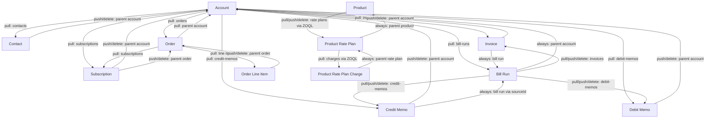

# Zuora Development Framework (zdf)

A CLI for syncing Zuora configuration and billing objects to local JSON files, editing them, and pushing changes back — with dependency-aware traversal so related records stay consistent.

## Table of Contents

- [Setup](#setup)
- [Global Flags](#global-flags)
- [Commands](#commands)
  - [auth](#auth)
  - [pull](#pull)
  - [push](#push)
  - [create](#create)
  - [delete](#delete)
  - [list](#list)
- [Resource Reference](#resource-reference)
  - [account](#account)
  - [contact](#contact)
  - [subscription](#subscription)
  - [order / order-line-item](#order--order-line-item)
  - [product](#product)
  - [product-rate-plan](#product-rate-plan)
  - [product-rate-plan-charge](#product-rate-plan-charge)
  - [invoice](#invoice)
  - [credit-memo](#credit-memo)
  - [debit-memo](#debit-memo)
  - [bill-run](#bill-run)
- [Dependency Graph](#dependency-graph)
- [Updatable Fields](#updatable-fields)
- [Output Directory Layout](#output-directory-layout)

---

## Setup

```bash
# Install dependencies and build
npm install
npx tsup bin/zdf.ts --format cjs --out-dir dist

# Authenticate (saved to ~/.zdf/config.json)
node dist/zdf.js auth login --name sandbox --url https://rest.sandbox.na.zuora.com --client-id <id> --client-secret <secret>
node dist/zdf.js auth use sandbox
```

---

## Global Flags

| Flag | Description |
|------|-------------|
| `--debug` | Print every HTTP request and response body |
| `--no-dependency` | Skip dependency traversal; operate only on the specified resource |

The `--no-dependency` flag is essential for large accounts with hundreds of child records (orders, subscriptions, invoices) where a full traversal would be impractical.

---

## Commands

### auth

| Subcommand | Description |
|------------|-------------|
| `auth login` | Save a new named environment (URL + OAuth credentials) |
| `auth use <name>` | Set the active environment |
| `auth show` | Show current active environment |
| `auth list` | List all saved environments |

### pull

Fetch a resource from Zuora and write it (plus all dependent records, unless `--no-dependency`) to `zdf-output/`.

```
zdf pull <resource> <id>
```

### push

Read the local JSON file and update the resource in Zuora. Dependent records are re-fetched (pulled) to keep local files consistent.

```
zdf push <resource> <id>
```

### create

Read a local JSON file and create a new resource in Zuora. The file is renamed to the Zuora-assigned ID after creation.

```
zdf create <resource> <name>
zdf create <resource> <name> --file /path/to/file.json
```

### delete

Delete a resource in Zuora. Dependent local files are cleaned up.

```
zdf delete <resource> <id>
```

### list

Fetch all records of a type and write them to local storage.

```
zdf list orders
```

---

## Resource Reference

### account

| Operation | Endpoint | Notes |
|-----------|----------|-------|
| pull | `GET /v1/accounts/{id}` | Also pulls all contacts, orders, subscriptions, invoices, credit-memos, debit-memos, bill-runs for the account |
| push | `PUT /v1/accounts/{id}` | Reads from `basicInfo` section of local file |
| create | `POST /v1/accounts` | |
| delete | `DELETE /v1/accounts/{id}` | |

**Limitations:**
- `push account` reads the `basicInfo` block from the pulled file. If the file was not pulled first, the command will error.
- Pulling an account with many child records (hundreds of orders, subscriptions, etc.) can be slow. Use `--no-dependency` to skip child traversal.
- The updatable field allowlist filters out read-only fields; custom fields (`__c` suffix) always pass through.

---

### contact

| Operation | Endpoint | Notes |
|-----------|----------|-------|
| pull | `GET /v1/contacts/{id}` | |
| push | `PUT /v1/contacts/{id}` | |
| create | `POST /v1/contacts` | |
| delete | `DELETE /v1/contacts/{id}` | |

**Limitations:**
- `push contact` and `delete contact` re-pull the parent account to keep local files consistent.
- Fields like `id`, `accountId`, and `accountNumber` are stripped before push (read-only).

---

### subscription

| Operation | Endpoint | Notes |
|-----------|----------|-------|
| pull | `GET /v1/subscriptions/{id}` | |
| push | `PUT /v1/subscriptions/{id}` | |
| create | `POST /v1/subscriptions` | |
| delete | — | Not supported (Zuora does not offer a delete endpoint for subscriptions) |

**Limitations:**
- Subscriptions cannot be deleted via the API; `zdf delete subscription` is blocked by design.
- Only a narrow set of header-level fields is updatable (term, auto-renew, notes, etc.). Rate plan and charge modifications require the Orders API.
- `push subscription` and `delete subscription` re-pull the parent account and linked order.

---

### order / order-line-item

| Operation | Resource | Endpoint | Notes |
|-----------|----------|----------|-------|
| pull | order | `GET /v1/orders/{orderNumber}` | Order number is the identifier (e.g. `O-00000001`) |
| pull | order-line-item | `GET /v1/order-line-items/{id}` | UUID identifier |
| list | orders | `GET /v1/orders?page=N&pageSize=50` | Paginated; also fetches all order line item details |
| create | order | `POST /v1/orders` | |
| push | order | `PUT /v1/orders/{orderNumber}` | |
| push | order-line-item | `PUT /v1/order-line-items/{id}` | |
| delete | order | `DELETE /v1/orders/{orderNumber}` | |

**Limitations:**
- `push order` only works on orders in **Draft** or **Scheduled** status. Completed or cancelled orders cannot be updated.
- The file from `pull order` stores data under an `order` key; the push command unwraps this automatically before sending to Zuora.
- `push order` re-pulls the parent account after updating.
- There is no `create order-line-item` or `delete order-line-item` — line items are managed through the order.

---

### product

| Operation | Endpoint | Notes |
|-----------|----------|-------|
| pull | `GET /v1/object/product/{id}` | Legacy object endpoint; returns PascalCase field names |
| push | `PUT /v1/object/product/{id}` | Legacy object endpoint; response uses `Success`/`Errors` (PascalCase) |
| create | `POST /v1/catalog/products` | Modern catalog endpoint |
| delete | `DELETE /v1/catalog/products/{id}` | Modern catalog endpoint |

**Limitations:**
- The Zuora v1 REST API does not support `PUT` for products; the legacy `/v1/object/` endpoint must be used for updates.
- Fields returned by the object endpoint are PascalCase (`Name`, `SKU`, `EffectiveStartDate`). The allowlist is configured accordingly.
- Tenant-specific required custom fields (e.g. `Item__c`) must be present in the push body. If your tenant requires them, ensure they are in the local file before pushing.
- `pull product` traverses to all child product-rate-plans and their charges via ZOQL.

---

### product-rate-plan

| Operation | Endpoint | Notes |
|-----------|----------|-------|
| pull | `GET /v1/object/product-rate-plan/{id}` | Legacy object endpoint; PascalCase fields |
| push | `PUT /v1/object/product-rate-plan/{id}` | Legacy object endpoint; `Success`/`Errors` response |
| create | `POST /v1/rateplan` | |
| delete | `DELETE /v1/rateplan/{id}` | |

**Limitations:**
- The Zuora v1 REST API does not support `PUT` for product rate plans; the legacy `/v1/object/` endpoint must be used for updates.
- `pull product-rate-plan` always re-pulls the parent product and all child charges.
- `push product-rate-plan` re-pulls the parent product after the update.
- Updatable fields are PascalCase: `Name`, `Description`, `EffectiveStartDate`, `EffectiveEndDate`.

---

### product-rate-plan-charge

| Operation | Endpoint | Notes |
|-----------|----------|-------|
| pull | `GET /v1/object/product-rate-plan-charge/{id}` | Legacy object endpoint; PascalCase fields |
| push | `PUT /v1/object/product-rate-plan-charge/{id}` | Legacy object endpoint; `Success`/`Errors` response |

**Limitations:**
- The Zuora v1 REST API does not support `PUT` for product rate plan charges; the legacy `/v1/object/` endpoint must be used for updates.
- `ChargeType` and `ChargeModel` are read-only and cannot be updated.
- There is no `create` or `delete` for charges — these are managed through the product catalog UI or the Orders API.
- `pull product-rate-plan-charge` always re-pulls the parent product-rate-plan.

---

### invoice

| Operation | Endpoint | Notes |
|-----------|----------|-------|
| pull | `GET /v1/invoices/{id}` + `GET /v1/invoices/{id}/items` | Line items are embedded inline in the local file |
| push | `PUT /v1/invoices/{id}` | |
| delete | `DELETE /v1/invoices/{id}` | Async; polls `GET /v1/async-jobs/{jobId}` until complete |

**Limitations:**
- Invoice line items (`invoiceItems`) are embedded in the pulled file for reference but **stripped from the push body** — Zuora does not accept them in a PUT request.
- Invoice deletion is asynchronous. The CLI polls every 2 seconds for up to 60 seconds.
- Only header-level fields are updatable: `autoPay`, `comments`, `dueDate`, `invoiceDate`, `paymentTerm`, `transferredToAccounting`.
- There is no `create invoice` command — invoices are generated by bill runs.
- `push invoice` and `delete invoice` re-pull the parent account.

---

### credit-memo

| Operation | Endpoint | Notes |
|-----------|----------|-------|
| pull | `GET /v1/credit-memos/{id}` + `GET /v1/credit-memos/{id}/items` | Line items embedded inline |
| push | `PUT /v1/credit-memos/{id}` | |
| delete | `DELETE /v1/credit-memos/{id}` | Must be in Draft status |

**Limitations:**
- Credit memo line items (`creditMemoItems`) are embedded for reference but stripped from the push body.
- Deletion requires the memo to be in **Draft** status.
- There is no `create credit-memo` command.
- `push credit-memo` and `delete credit-memo` re-pull the parent account.

---

### debit-memo

| Operation | Endpoint | Notes |
|-----------|----------|-------|
| pull | `GET /v1/debit-memos/{id}` + `GET /v1/debit-memos/{id}/items` | Line items embedded inline |
| push | `PUT /v1/debit-memos/{id}` | |
| delete | `DELETE /v1/debit-memos/{id}` | Must be in Canceled status |

**Limitations:**
- Debit memo line items (`debitMemoItems`) are embedded for reference but stripped from the push body.
- Deletion requires the memo to be in **Canceled** status.
- There is no `create debit-memo` command.
- `push debit-memo` and `delete debit-memo` re-pull the parent account.

---

### bill-run

| Operation | Endpoint | Notes |
|-----------|----------|-------|
| pull | `GET /v1/bill-runs/{id}` | Also pulls all invoices, credit-memos, debit-memos produced by the run |
| push | — | No PUT endpoint exists; `push bill-run` re-fetches (same as pull) |
| delete | `DELETE /v1/bill-runs/{id}` | Must be in Canceled or Error status |

**Limitations:**
- **Bill runs cannot be updated** via the Zuora API. `push bill-run` re-fetches the latest data rather than writing anything.
- Deletion requires the bill run to be in **Canceled** or **Error** status.
- There is no `create bill-run` command.

---

## Dependency Graph

When you pull or push a resource, the CLI automatically traverses its dependency tree (unless `--no-dependency` is set). The diagram below shows which resources are traversed for each operation.



### Traversal Rules Summary

| Resource | Dependency Direction | Condition |
|----------|---------------------|-----------|
| account | → contacts, orders, subscriptions, invoices, credit-memos, debit-memos, bill-runs | pull only |
| account | → parent account (if `parentId` set) | always |
| contact | → parent account | push/delete only |
| order | → parent account (via account number lookup) | always |
| order | → order line items, subscriptions | always |
| order-line-item | → parent order | push/delete only |
| subscription | → parent account, parent order | push/delete only |
| product | → product-rate-plans (ZOQL) | always |
| product-rate-plan | → parent product | always |
| product-rate-plan | → product-rate-plan-charges (ZOQL) | pull only |
| product-rate-plan-charge | → parent product-rate-plan | always |
| invoice | → parent account | push/delete only |
| invoice | → bill run (if `billRunId` set) | always |
| credit-memo | → parent account | push/delete only |
| credit-memo | → bill run (if `sourceId` set, via ZOQL) | always |
| debit-memo | → parent account | push/delete only |
| bill-run | → parent account (if `accountId` set) | always |
| bill-run | → invoices (ZOQL), credit-memos, debit-memos (ZOQL) | always |

A visited-set prevents loops: if a resource has already been processed in the current traversal it is skipped, so circular relationships (e.g. account → order → account) do not cause infinite recursion.

---

## Updatable Fields

`push` commands strip all fields not in the allowlist before sending to Zuora. Custom fields (ending in `__c`) always pass through regardless of the allowlist.

| Resource | Sample Updatable Fields |
|----------|------------------------|
| account | `name`, `autoPay`, `paymentTerm`, `notes`, `batch`, `billCycleDay` |
| contact | `firstName`, `lastName`, `workEmail`, `address1`, `city`, `state`, `country` |
| subscription | `autoRenew`, `notes`, `currentTerm`, `renewalTerm`, `termType` |
| order | `category`, `description`, `orderDate`, `reasonCode` |
| order-line-item | `itemName`, `quantity`, `amountPerUnit`, `description`, `taxCode` |
| product | `Name`, `SKU`, `Description`, `EffectiveStartDate`, `EffectiveEndDate`, `AllowFeatureChanges` |
| product-rate-plan | `Name`, `Description`, `EffectiveStartDate`, `EffectiveEndDate` |
| product-rate-plan-charge | `Name`, `Description`, `BillingPeriod`, `AccountingCode`, `TaxCode`, `UOM` |
| invoice | `autoPay`, `comments`, `dueDate`, `invoiceDate`, `paymentTerm` |
| credit-memo | `comment`, `creditMemoDate`, `reasonCode`, `autoApplyUponPosting` |
| debit-memo | `comment`, `debitMemoDate`, `dueDate`, `paymentTerm`, `reasonCode` |

Note: product, product-rate-plan, and product-rate-plan-charge use the legacy `/v1/object/` API which requires **PascalCase** field names.

---

## Output Directory Layout

```
zdf-output/
├── accounts/
│   └── {id}.json
├── contacts/
│   └── {id}.json
├── subscriptions/
│   └── {id}.json
├── orders/
│   └── {orderNumber}.json
├── order-line-items/
│   └── {id}.json
├── products/
│   └── {id}.json
├── product-rate-plans/
│   └── {id}.json
├── product-rate-plan-charges/
│   └── {id}.json
├── invoices/
│   └── {id}.json
├── credit-memos/
│   └── {id}.json
├── debit-memos/
│   └── {id}.json
└── bill-runs/
    └── {id}.json
```

Files are written atomically (full replacement on every pull/push). The filename is always the Zuora ID or order number — files are renamed automatically after `create` once Zuora returns the assigned ID.
